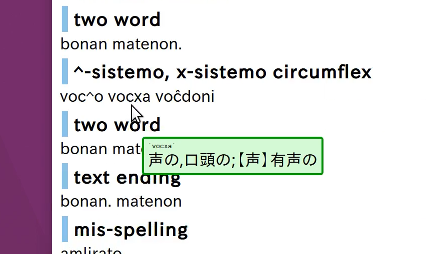
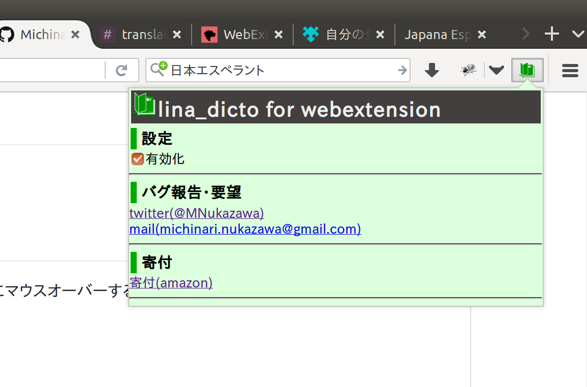

lina\_dicto for webextension
====
\- Dictionary of Esperanto to Japanese for web browser -

# About
lina\_dicto for webextension は、ブラウザ上でEsperantoの単語の上にマウスオーバーすると、日本語翻訳をホバー表示(ツールチップ表示)するブラウザ拡張です。  
とりあえず作ってみた版。  
FireFoxに対応しています。  
Chromeに対応する予定。  

拡張をインストールしなくても動作する[テストページ](http://michinarinukazawa.github.io/lina_dicto_for_webextension/index.html)で、翻訳表示を試すことができます。

その他のバージョン：  
[lina\_dicto (for Win/MacOSX/Linux)](https://github.com/MichinariNukazawa/lina_dicto)  
[lina\_dicto for android](https://github.com/MichinariNukazawa/lina_dicto_for_android)  

# Screenshot/Image
  
  

# Get lina\_dicto for webextension
[Firefox Add-ons](https://addons.mozilla.org/ja/firefox/addon/lina_dicto_for_webextension/)  
Chromeエクステンションとして公開予定。  

## License
Clause-2 BSD License  
Exclude dictionary data.(辞書ファイルは辞書ファイル毎のライセンスに準じます)  

## 既知の不具合について
Q:FireFox56で、x-sistemo等をマウスホバーしまくると、2秒ほどフリーズすることがある。  
A:Chromium62で発生しない。FireFox56の配列かregexがChromiumと違って遅くなる瞬間があるためだと思う。いずれFireFoxがアップデートで問題を修正し、勝手に解決すると考えている。  

Q:Chromium62で、index.htmlの"voĉdoni"の上部で行先頭のvoc^oを誤検出するようだ。  
A:FireFox56では発生しない。Chromium62のマウス位置文字列検出の問題だと思う。いずれChromiumがアップデートで問題を修正し、勝手に解決すると考えている。  

Q:修正しないってこと？ ブラウザバグなんて考えづらいよ。もうちょっと自分のコードを疑って調べてみたら？  
A:もちろん疑っている。インパクトがあるならもっと調査し、修正する。ただ、本extensionは基本機能は実現して提供できており問題は回避あるいは無視可能なもので、瑣末な使い勝手の問題に過ぎない。修正はコストメリットが少ないと思う。インパクトとは具体的には、利用者数が5万人を超えるとか、バグ修正依頼が来るとか、バグ修正依頼といっしょに寄付があるとか。  
もちろん、あなたがパッチorフォークするという手もある。ぜひ前向きに検討してみて欲しい。  

# Contact
mail: [michinari.nukazawa@gmail.com][mailto]  
twitter: [@MNukazawa][twitter]  

Develop by Michinari.Nukazawa, in project "[daisy bell][pixiv_booth_project_daisy_bell]".  

[pixiv_booth_project_daisy_bell]: https://daisy-bell.booth.pm/
[mailto]: mailto:michinari.nukazawa@gmail.com
[twitter]: https://twitter.com/MNukazawa

